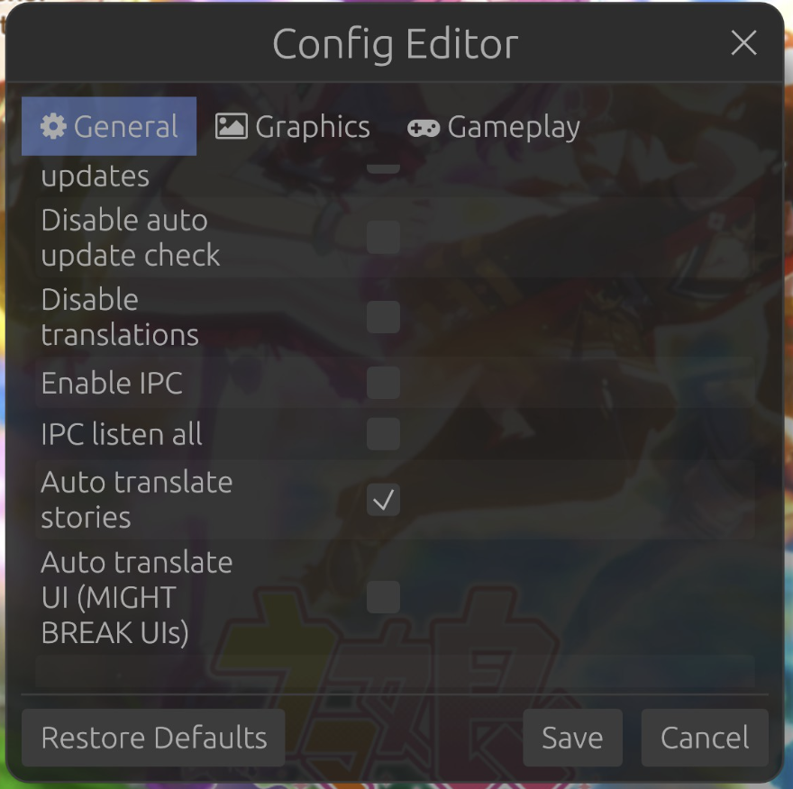
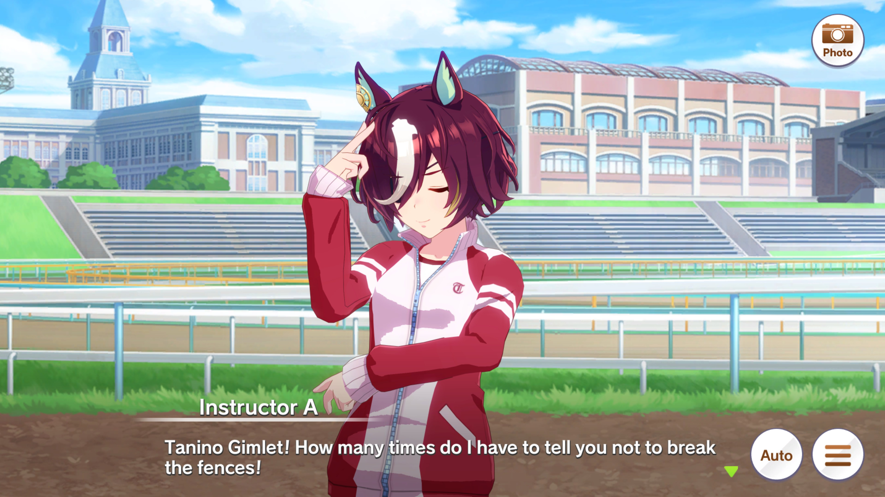
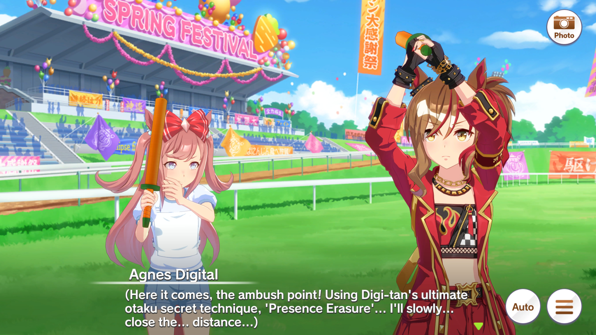
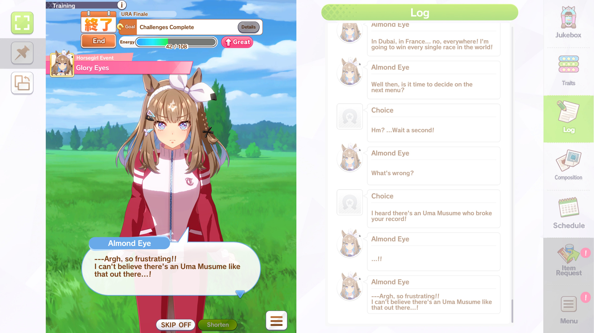
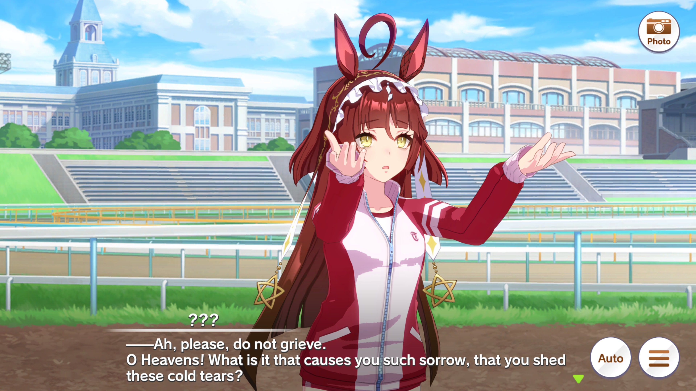

# UmaLLM

A standalone LLM translation API server, spun off from [Sugoi Toolkit](https://www.patreon.com/mingshiba) by MingShiba. Meant as an alternative to using Sugoi Offline for the funny horse game. Works with Hachimi to retrieve and translate stories in-game.

While LLMs still are still not perfect at translating, they've come a long way and are semi-readable now, especially when compared to Google Translate or DeepL. This project also isn't meant to be a replacement for UmaTL. Human translations will be better 99% of the time. This is more of a tool for those that want something translated ASAP.

<p align="center">
  
</p>

## AI Disclaimer

Heavily vibe-coded with the assistance of Qwen3.6-27B. This project is mainly a byproduct of me experimenting with the b9180 MTP feature.

## What Does It Do?

Sits on a local port, waits for translation requests, and sends them off to your LLM of choice. Drop it in front of any app that speaks Sugoi Toolkit's translation API protocol, and it'll handle the rest.

Features:
- **Structured output** - uses JSON schema to constrain LLM responses, making dropped or garbled translations structurally impossible
- **Batch translation** - sends all lines in one LLM call for better consistency (active when parallel workers = 1)
- **Parallel chunked translation** - splits work across multiple workers for faster throughput (But this slightly increases the risk of bad output)
- **Character memory** - keeps track of character names, nicknames, and context so translations stay consistent (appended to the system prompt)
- **Selective retry logic** - full retry on count mismatch, or fixes individual trivial lines without retranslating the whole chunk
- **Output cleaning** - strips stray backslashes, doubled braces, and collapses newlines so Hachimi handles line breaks properly
- **Format recovery** - handles truncated responses, numbered lists, markdown fences, malformed JSON, and other LLM quirks
- **File logging** - timestamped logs in `logs/` folder, keeps 5 most recent

## Installation

1. Have Python 3.12+ installed and on PATH

2. Run setup.bat to install dependencies (botocore is optional, LiteLLM seems to require it if you use AWS Bedrock/SageMaker)

3. Run configure.bat to configure LLM + Other settings. Default settings points to LM Studio running gemma-4-26b-a4b-it@q4_k_m, with instructions to localize dialogue from Japanese to English

4. Configure Hachimi to point to port 14368:
   - Open `Game Root/hachimi/config.json` and set:
     ```json
     "sugoi_url": "http://127.0.0.1:14368"
     ```
   - In-game, open Hachimi's Config Editor > General and check **Auto Translate Stories**

<p align="center">
  
</p>

5. Run launch.bat to start the translation server

6. Start the game and Hachimi will send translation Requests to port 14368 when it encounters any Japanese dialogue.

7. ???

8. Profit

## Settings

| Setting | Description |
|---|---|
| `HTTP_port_number` | Port the server listens on (default: 14368) |
| `model_name` | LiteLLM-compatible model name, refer to [LiteLLM Providers](https://docs.litellm.ai/docs/providers) for model names |
| `api_server` | Your LLM API endpoint |
| `api_key` | API key (or `null` for local) |
| `system_prompt` | The translation instructions sent to the LLM |
| `context_lines` | How many previous lines to keep in conversation history (0 = none) |
| `temperature`, `top_p`, `top_k`, `min_p` | Sampling parameters |
| `repetition_penalty` | Repetition penalty (for supported backends) |
| `frequency_penalty` | Frequency penalty to reduce repetitive output (default: 0.5) |
| `presence_penalty` | Presence penalty to encourage varied output (default: 0.5) |
| `max_tokens` | Max tokens per LLM response. If your translations are getting cut off, increasing this might help  |
| `parallel_workers` | **1** = single batch mode (all lines in one call). **>1** = parallel mode (lines split into chunks) |
| `chunk_size` | Lines per chunk when using parallel mode (ignored when `parallel_workers` = 1) |
| `max_retries` | How many times to retry if the LLM returns bad output. The worse the LLM, the higher this needs to be. If retry attempts go past this value, outputs 'Error' |

### Translation Modes

- **Single batch** (`parallel_workers: 1`) - sends everything to the LLM in one shot, similar to how it works with Sugoi Offline. Best for consistency and accuracy, but might be slower than parallel depending on your GPU, especially on events with lots of text

- **Parallel** (`parallel_workers: >1`, `chunk_size: <N>`) - splits lines into chunks and processes them across multiple workers. Good for GPUs that can handle parallel requests or for users paying for API keys. `context_lines` looks in both directions (if context lines is 3, then the 3 raw texts before and after the current message are sent to the LLM for context)

- For an RTX 5090, I've found `parallel_workers: 5` and `chunk_size: 20` to be the sweet spot. Using gemma-4-26b-a4b-it@q4_k_m, this setting usually translates almost every event in 4-10 seconds, and for large walls of text it takes around 15 seconds. The good news is Hachimi caches auto translation, which means you can just set Auto Translate to on and enable Auto Play and read a Trainee's story with minimal interruptions on the next training session.

## Character Memory

I've included a character memory file on `data/character_memory.json` with character names, nicknames, and notes. The server will include relevant character info in each translation prompt so the LLM knows how to handle names and personalities.

Example:
```json
{
  "characters": {
    "スペシャルウィーク": {
      "name": "Special Week",
      "nickname": ["Spe (スペ)"],
      "gender": "female",
      "notes": "Speaks with a rustic, country accent."
    }
  }
}
```

## Logging

The server writes timestamped log files to the `logs/` folder. Each server run creates a new log file, and the 5 most recent are kept. Logs include translation timing, retry attempts, and RAW/TRN pairs for debugging/comparing raw JP text to TL'ed.

## Configuration

Included is a batch file **configure.bat** for easier configuration of the features listed above. Designed to be user friendly to minimize the times you have to edit settings.json and character_memory.json manually.

## Examples

<p align="center">
  
</p>

<p align="center">
  
</p>

<p align="center">
  
</p>

<p align="center">
  
</p>

<p align="center">
  
</p>

<p align="center">
  
</p>

## Credits

Derived from [Sugoi Toolkit](https://www.patreon.com/mingshiba) by MingShiba. This repository does not contain proprietary model weights.

Hachimi developers for the Auto Translate feature.
